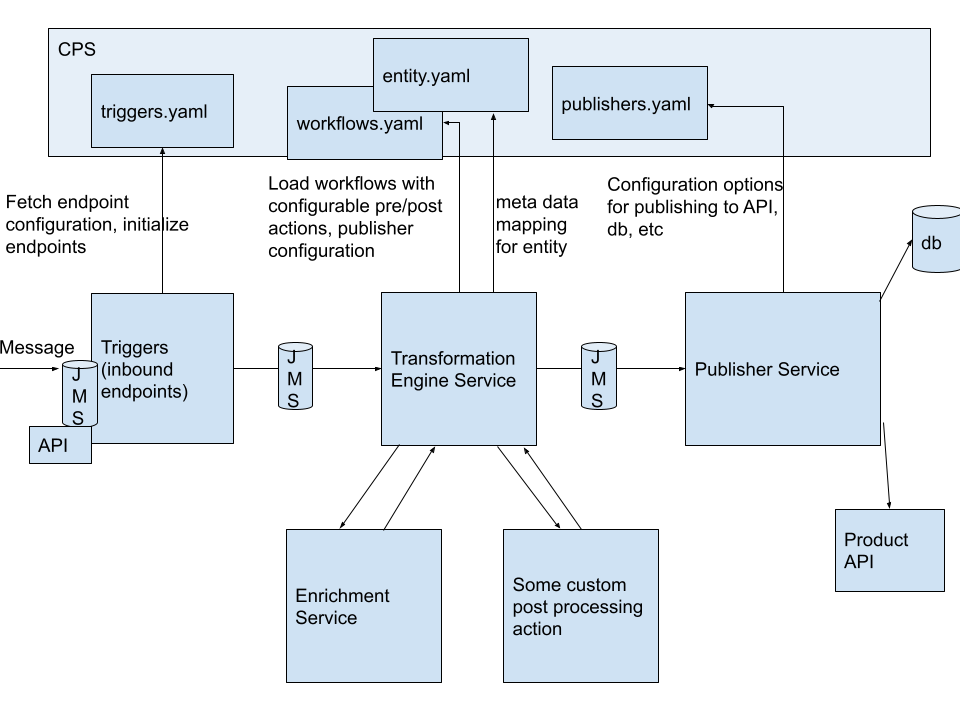

# NEO - Configurable Metadata Driven Adapter

Brainstorming some ideas for workflow configuration...

 
[Link if image doesn't work](arch.png)

## Configuring workflows
A workflow for a message consists of a trigger, an action, and a publisher. 

* Many workflows can use the same trigger, for example many workflows may use the same JMS listener or a generic ingestion API endpoint
* The transform engine can also call other pre or post processing actions
* After post processing actions, messages are pushed to the Publisher Service
* Publisher Service is responsible for actual publishing to target applications
* Many workflows may use the same publisher, for example REST API call to Product API.
  * Note: can reduce complexity of publisher by having it call microservice APIs (more on this later)

### Configuration structure
```

adapter
|-- config_repo
|    |-- triggers.yaml
|    |-- workflows.yaml
|    |-- publishers.yaml
|    |-- resources
|         |-- mapping
|             |-- itemConfig.yaml
|         |-- actions
|             |-- my_custom_enrichment.py
```


**triggers.yaml**
*Note: this has not been implemented yet*
```yaml
triggers:
  - name: "STANDARD_JMS_FLOW"
    type: "JMS"
    options:
      queue_name: "PYCAT_INBOUND"
```


**workflows.yaml**
Example (implemented for Catman):
```yaml
workflows:
  location:
    publisher: "catman_api"
    publisherOptions:
      path: "/ckb-stores/v2/stores"
      db_parent_prc_key: "3"
      filter: "?$filter=storeNumber eq %s & $select =dbKey"
      filterField: "storenumber"
  item:
    publisher: "catman_api"
    publisherOptions:
      path: "/ckb-products/v2/products"
      db_parent_prc_key: "1"
      filter: "?$filter=ID eq '%s'&$select =dbKey"
      filterField: "id"
```


**publishers.yaml**
Example (implemented for Catman)
```yaml
publishers:
  catman_api:
    publisher_type: "http"
    protocol: "http"
    host: "md1npdvcatman1"
    port : "7500"
    authorisation:
      port : "7600"
      resourcePath : "/IAM/connect/token"
      username : 'ckbadmin'
      client_id : 'ResOwnerClient'
      password : 'ckbadmin'
      grantType : 'password'
      scope : 'access'
  catman_db:
    name: "CATMAN_DB"
    host: dbhost
    database: database

```

### Triggers (a.k.a. Inbound Endpoints)
> Note: this has not been implemented yet, currently supports one JMS queue inbound.

A workflow is started from a trigger. Triggers supported out of the box are:
1. HTTP Request 
2. JMS message recieved
3. Scheduler

These can be added in **triggers.yaml** by adding a new trigger configuration, for example:

```yaml
triggers:
  - name: "STANDARD_JMS_FLOW"
    type: "JMS"
    options:
      queue_name: "PYCAT_INBOUND"
```

### Transformation Engine (transform_engine)
This maps the message from the source model to the target model using the metadata configuration.

Example:
**itemConfig.yaml**
```yaml
---
Mappings:
- modelMapping:
    sourceModel: item
    targetModel: product
    fieldMapping:
    - sourceField: itemId.additionalTradeItemId.value
      targetField: UPC
    - sourceField: itemId.primaryId
      targetField: ID
```


### Enrichment Service
Pass this logic off on the system layer 

~~Optional. Can be used for any look ups or other enrichment cases.~~

~~Should this be its own microservice? (with queue between services)~~

~~Maybe this can have some default configurable behavior and if anything more complex is needed, a custom action can be written and invoked~~

~~Configuration maps a message type to a function. This can be a microservice to encapsulate some product/customer specific logic.~~

### Adding a custom action
Pass this logic off on the system layer

~~TBD. This can be used when a business logic mapping rule or enrichment is too complicated and supporting it via configuration becomes too complex. ~~

### Publishers
After the action has been completed, the message will be published.

**publishers.yaml**
```yaml
publishers:
  catman_api:
    publisher_type: "http"
    protocol: "http"
    host: "md1npdvcatman1"
    port : "7500"
    authorisation:
      port : "7600"
      resourcePath : "/IAM/connect/token"
      username : 'ckbadmin'
      client_id : 'ResOwnerClient'
      password : 'ckbadmin'
      grantType : 'password'
      scope : 'access'
  catman_db:
    name: "CATMAN_DB"
    host: dbhost
    database: database
```

## Scenario examples

### Outbound data flows
Extracting data from BY product and pushing it outbound to Customer or another BY product

Create a trigger for workflow, in this case a scheduler:
```yaml
# triggers.yaml
triggers:
  - name: "Outbound planning data"
    type: "Scheduler"
    options:
      cron: "0 * * * *"
```

Define related workflow: 

Note, should change this so that fetching data isn't part of the transformation engine if pre processing actions are part of the transformation engine
```yaml
# workflows.yaml
workflows:
  location:
    publisher: "catman_api"
    publisherOptions:
      path: "/ckb-stores/v2/stores"
      db_parent_prc_key: "3"
      filter: "?$filter=storeNumber eq %s & $select =dbKey"
      filterField: "storenumber"
  item:
    publisher: "catman_api"
    publisherOptions:
      path: "/ckb-products/v2/products"
      db_parent_prc_key: "1"
      filter: "?$filter=ID eq '%s'&$select =dbKey"
      filterField: "id"
```

Define publisher for outbound target:
```yaml
# publishers.yaml
publishers:
  catman_api:
    publisher_type: "http"
    protocol: "http"
    host: "md1npdvcatman1"
    port : "7500"
    authorisation:
      port : "7600"
      resourcePath : "/IAM/connect/token"
      username : 'ckbadmin'
      client_id : 'ResOwnerClient'
      password : 'ckbadmin'
      grantType : 'password'
      scope : 'access'
```

### Chained API calls 
Pass this logic off on the system layer 


### Dealing with gaps in product APIs
Pass this logic off on the system layer 
~~A few ways have come up to handle this, one or both together can be used...~~

~~1. Publisher service handles logic of which entities call db or API. Transformation engine itself is agnostic, only pushes data on to publisher API (or through queue)~~
2. All entities call APIs, but for entities where there is a gap, we write a microservice API and point the call to our micro API. That micro API has the logic to actually call the product db within it

Option #2 above is the same as "Pass this logic off on the system layer"

### Calling db to create relationships between objects
Pass this logic off on the system layer 
~~Can this be a pre-processing or post-processing action?~~


