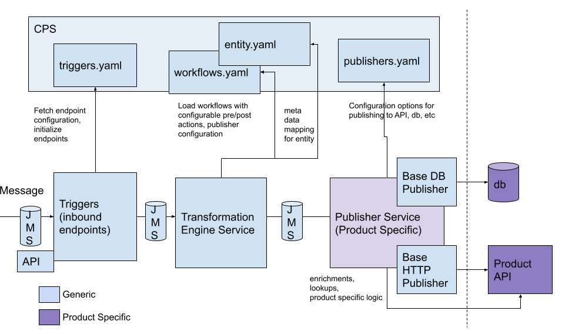

# NEO - Configurable Metadata Driven Adapter

## Adapter Mission Statement
* To provide a metadata driven transformation engine which is not product or integration specific
* To provide an adapter which is able to be deployed without understanding a mapping language or writing mapping code
* To separate the transformation engine and application specific logic and publishing in a way so that:
  * In order to integrate with one product vs. another, we should only need to change the configuration to point to a different publisher service
  * In order to integrate with one customer vs. another, we should only need to change the metadata mapping 

## Adapter Architecture

 
[Link if image doesn't work](arch-v2.png)

* Triggers are configuration driven
* When application is launched, triggers initialize (e.g. JMS/HTTP listener, scheduler)
* When trigger is executed, it passes message on to transformation engine
* Transformation engine handles transformation only
* Complex business logic takes place in the Publisher Service
* Publisher Service can be product specific 

## Configuring workflows
A workflow for a message consists of a trigger, transformation, and publishing.

* Many workflows can use the same trigger, for example many workflows may use the same JMS listener or a generic ingestion API endpoint
* Publisher Service is responsible for actual publishing to target applications
* A Publisher Service can be generic, such as simply pushing a message to a JMS queue, or a Publisher Service can be created specific to a particular integration which contains product specific logic. (Similar to system layer API in API led architecture)

### Triggers (a.k.a. Inbound Endpoints)

A workflow is started from a trigger. Triggers supported out of the box are:
1. HTTP Request 
2. JMS message recieved
3. Scheduler

These can be added in **triggers.yaml** by adding a new trigger configuration, for example:

```yaml
triggers:
  - name: "STANDARD_JMS_FLOW"
    type: "JMS"
    options:
      queue_name: "PYCAT_INBOUND"
```

### Transformation Engine (transform_engine)
This maps the message from the source model to the target model using the metadata configuration.

Example:
**itemConfig.yaml**
```yaml
---
Mappings:
- modelMapping:
    sourceModel: item
    targetModel: product
    fieldMapping:
    - sourceField: itemId.additionalTradeItemId.value
      targetField: UPC
    - sourceField: itemId.primaryId
      targetField: ID
```

### Publishers
After the action has been completed, the message will be published.

**publishers.yaml**
```yaml
publishers:
  catman_api:
    publisher_type: "http"
    protocol: "http"
    host: "md1npdvcatman1"
    port : "7500"
    authorisation:
      port : "7600"
      resourcePath : "/IAM/connect/token"
      username : 'ckbadmin'
      client_id : 'ResOwnerClient'
      password : 'ckbadmin'
      grantType : 'password'
      scope : 'access'
  catman_db:
    name: "CATMAN_DB"
    host: dbhost
    database: database
```

### Configuration structure
```

adapter
|-- config_repo
|    |-- triggers.yaml
|    |-- workflows.yaml
|    |-- publishers.yaml
|    |-- resources
|         |-- mapping
|             |-- itemConfig.yaml
|         |-- actions
|             |-- my_custom_enrichment.py
```


**triggers.yaml**
```yaml
triggers:
  - name: "STANDARD_JMS_FLOW"
    type: "JMS"
    options:
      queue_name: "PYCAT_INBOUND"
```


**workflows.yaml**
Example (implemented for Catman):
```yaml
workflows:
  location:
    publisher: "catman_publisher_service"
    publisherOptions:
      path: "/ckb-stores/v2/stores"
      db_parent_prc_key: "3"
      filter: "?$filter=storeNumber eq %s & $select =dbKey"
      filterField: "storenumber"
  item:
    publisher: "catman_publisher_service"
    publisherOptions:
      path: "/ckb-products/v2/products"
      db_parent_prc_key: "1"
      filter: "?$filter=ID eq '%s'&$select =dbKey"
      filterField: "id"
```


**publishers.yaml**
Example (implemented for Catman)
```yaml
publishers:
  catman_publisher_service:
    catman_api:
        publisher_type: "http"
        protocol: "http"
        host: "md1npdvcatman1"
        port : "7500"
        authorisation:
        port : "7600"
        resourcePath : "/IAM/connect/token"
        username : 'ckbadmin'
        client_id : 'ResOwnerClient'
        password : 'ckbadmin'
        grantType : 'password'
        scope : 'access'
    catman_db:
        name: "CATMAN_DB"
        host: dbhost
        database: database

```


## Scenario examples

### Outbound data flows
Extracting data from BY product and pushing it outbound to Customer or another BY product

Create a trigger for workflow, in this case a scheduler:
```yaml
# triggers.yaml
triggers:
  - name: "Outbound planning data"
    type: "Scheduler"
    options:
      cron: "0 * * * *"
```

Define related workflow: 

Note, should change this so that fetching data isn't part of the transformation engine if pre processing actions are part of the transformation engine
```yaml
# workflows.yaml
workflows:
  location:
    publisher: "catman_api"
    publisherOptions:
      path: "/ckb-stores/v2/stores"
      db_parent_prc_key: "3"
      filter: "?$filter=storeNumber eq %s & $select =dbKey"
      filterField: "storenumber"
  item:
    publisher: "catman_api"
    publisherOptions:
      path: "/ckb-products/v2/products"
      db_parent_prc_key: "1"
      filter: "?$filter=ID eq '%s'&$select =dbKey"
      filterField: "id"
```

Define publisher for outbound target:
```yaml
# publishers.yaml
publishers:
    jms_publisher:
        queue_name: "PYCATMAN_TO_SAP_QUEUE"
```

### Enrichment
Enrichments can be built into the Publisher Service as needed for specific integrations.

An example from Catman of this is that we need the **dbKey** for any entity to make an update on it. The message we get for an update will not contain **dbKey** so we need to look that up to use for making the update.

1. Transform the message based on the metadata mapping
2. Send message to the Publisher service
3. Publisher Service (Catman specific) performs any lookups and enrichment required before publishing to the target Product


### Chained API calls 
Example use case from Catman integration:

When adding a store, we need to also create a dummy floorplan and create a store user.

1. Transform the store message based on the metadata mapping
2. Send the store message to the Publisher Service
3. Publisher Service (Catman specific) has logic written for this entity which handles chain of API calls


### Dealing with gaps in product APIs
The logic for handling this is contained completely within the Publisher Service.

To the transformation engine, the details about how a message is published to its target do no matter.

The Publisher Service may use APIs for publishing some entities and DB calls for others. There could also be a workflow for a single entity which contains both API calls and DB calls.

### Calling db to create relationships between objects
This responsibility also falls on the Publisher Service.


